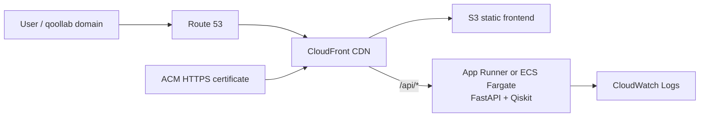
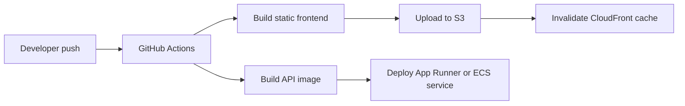
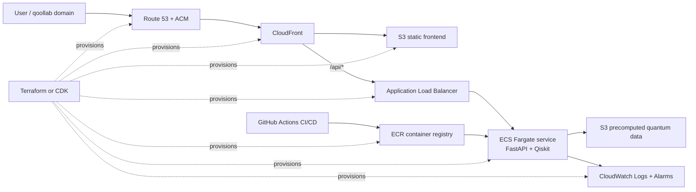

# Entangled Body

Entangled Body is a separated frontend/backend prototype for rendering a GLB body as a tile cloud and driving the interaction state with quantum measurement data.

## Architecture

- `apps/web`: Next.js frontend with React Three Fiber and Three.js.
- `apps/api`: FastAPI backend with Qiskit Aer simulator code.
- `apps/api/data/precomputed_samples.json`: weak measurement samples used by hover interactions.
- `apps/web/public/models/astronaut_rigged_and_animated.glb`: source model sampled into render tiles.

## AWS Deployment Architecture

The README architecture is written around the **initial deployment target**. The expanded ECS architecture is documented as a later scaling path, not as the first version to run continuously. This keeps the project cost-aware while still leaving room for deeper AWS deployment work after the creative quantum experience is stable.

### Initial Deployment Target

The first AWS deployment uses S3 and CloudFront for the frontend, plus one managed container service for the FastAPI quantum backend. This is the recommended starting point for the challenge-ready live version because it is inexpensive, understandable, and keeps the focus on the quantum creative interaction.



- Host the Next.js static frontend in S3 and serve it through CloudFront.
- Restrict the S3 origin with CloudFront Origin Access Control, so users cannot bypass CloudFront and read the bucket directly.
- Use Route 53 and ACM for the custom HTTPS domain.
- Deploy the FastAPI backend from the existing Docker image.
- Prefer App Runner for the first backend deployment if simplicity and cost control matter more than showing ECS internals.
- Use a single ECS Fargate service as the alternative if the deployment needs to demonstrate ECS directly.
- Use CloudWatch Logs with a short retention period.
- Add an AWS Budget or billing alarm before leaving the service running.

### Deployment Flow



- Frontend CI builds the static site, syncs the output to S3, and invalidates CloudFront.
- Backend CI builds the FastAPI container and deploys it to App Runner or ECS.
- Environment-specific values such as API base URL, AWS account ID, and service names should be stored as GitHub Actions secrets or environment variables.
- If S3 static hosting is used, the Next.js app must remain compatible with static export constraints.

### Expansion Target

After the first deployment is stable, the architecture can be expanded if Entangled Body needs more control over backend routing, container operations, observability, or infrastructure automation:



This version gives more operational control, but it is not the recommended always-on first deployment because ALB, ECS, networking, and observability resources increase cost and operational surface area.

### Cost Controls

- Avoid a NAT Gateway for the first ECS version by running the Fargate task in a public subnet with a public IP.
- Keep the Fargate desired task count at `1` for a challenge/demo deployment.
- Use small CPU and memory values first, then tune only if Qiskit workloads need more.
- Consider App Runner instead of ALB + ECS when the project does not need VPC-level control.
- Keep CloudWatch log retention short, such as 3-7 days.
- Use AWS Budgets or billing alarms before enabling always-on resources.
- Tear down or scale down ALB/ECS resources when they are only needed for a demo.

### Monitoring

- Use `/health` and `/quantum/health` as backend health check endpoints.
- Send backend container logs to CloudWatch Logs.
- Add alarms for service errors, unhealthy backend responses, and unexpected monthly spend.
- Start with minimal metrics and alarms, then expand once the service is receiving real traffic.

### Tradeoffs

- **Why S3 + CloudFront instead of Amplify Hosting:** the main goal is to present Entangled Body as a fast, reliable web-based quantum creative experience. S3 and CloudFront keep the visual frontend lightweight, cacheable, and easy to serve globally while still leaving the deployment path transparent.
- **Why App Runner first:** the backend exists to support the interaction between the browser, FastAPI, Qiskit, and future IonQ execution. App Runner keeps the first live version focused on the creative quantum experience instead of early networking complexity.
- **Why ECS Fargate later:** ECS Fargate is an expansion path if the project needs more control over container runtime, routing, observability, or infrastructure-as-code. It is not required for the first challenge-ready version.
- **Why no NAT Gateway in the small ECS version:** if ECS is used for a demo deployment, avoiding a NAT Gateway keeps fixed cloud cost low. The infrastructure should support the artwork and quantum interaction, not become the center of the project.
- **Why precomputed quantum data exists:** precomputed samples keep hover interactions fast and predictable, reduce backend compute load, and preserve the interactive rhythm of the piece while live quantum or simulator calls remain available for stronger measurement events.

### Infrastructure Roadmap

1. Document the target architecture and cost controls in this README.
2. Make the frontend compatible with S3 static deployment.
3. Deploy the frontend to S3 behind CloudFront with OAC.
4. Deploy the FastAPI backend to App Runner or one small ECS Fargate service.
5. Add GitHub Actions for frontend and backend deployment.
6. Add Route 53, ACM, CloudWatch logs, and budget alarms.
7. Expand to ALB + ECS Fargate + ECR + Terraform/CDK only if the project needs more operational control or a stronger AWS implementation story.

## Run the Frontend

```bash
npm install
npm run dev
```

Frontend URL:

```text
http://localhost:3000
```

For the S3 + CloudFront deployment, the frontend is exported as static files and Next.js does not proxy API requests. Keep frontend API calls on `/api/*`; configure CloudFront with an ordered behavior that sends `/api/*` to the App Runner origin. For local development, point the browser directly at the API:

```bash
NEXT_PUBLIC_API_BASE_URL=http://127.0.0.1:8000 npm run dev
```

## Run the Backend

```bash
cd apps/api
pip install -r requirements.txt
python -m uvicorn main:app --host 0.0.0.0 --port 8000 --reload
```

Backend URLs:

- `GET http://localhost:8000/health`
- `GET http://localhost:8000/quantum/health`
- `GET http://localhost:8000/quantum/precomputed`
- `POST http://localhost:8000/quantum/measure`

## Interaction Model

- Hover performs a weak measurement by reading precomputed quantum samples from `/quantum/precomputed`.
- Click performs a strong measurement by calling `/quantum/measure`, which runs a 6-qubit Qiskit Aer circuit.
- Hold triggers global collapse in the frontend, moving all tiles from scattered positions to the sampled body surface.

## Tile Sampling

The frontend loads the GLB from `/models/astronaut_rigged_and_animated.glb`, traverses mesh geometry, samples surface points with `MeshSurfaceSampler`, and converts those points into tile records. Region assignment prefers mesh names such as head, torso, arm, or leg. If the mesh name is not useful, the sampler falls back to spatial classification using vertical position for head/torso/legs and horizontal position for left/right.

## Quantum Mapping

The backend simulator returns counts and the dominant bitstring. `quantum/mapper.py` converts counts into per-region values:

- `activation`: how strongly tiles cluster and glow.
- `coherence`: how much noise is reduced.
- `displacement`: a signed visual offset for measurement response.

The frontend `mapQuantumToBody.ts` normalizes that JSON into body region state and entanglement links for the tile renderer.

## Docker

```bash
docker compose up --build
```

## Music Credit

Song: Eden  
Composer: Onycs  
Website: https://www.youtube.com/channel/UCNQ6vKZ5ogEZ0tM2TvxLhQA  
License: Creative Commons (BY 3.0) https://creativecommons.org/licenses/by/3.0/  
Music powered by BreakingCopyright: https://breakingcopyright.com
