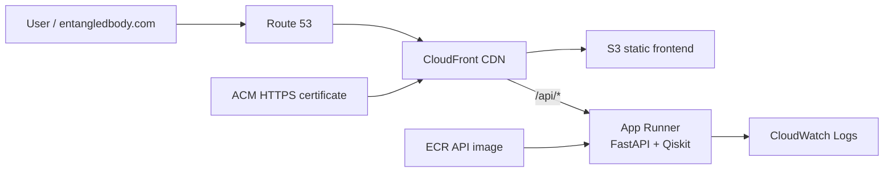

# Entangled Body

Entangled Body is a separated frontend/backend prototype for rendering a GLB body as a tile cloud and driving the interaction state with quantum measurement data.

## Architecture

- `apps/web`: Next.js frontend with React Three Fiber and Three.js.
- `apps/api`: FastAPI backend with Qiskit Aer simulator code.
- `apps/api/data/precomputed_samples.json`: weak measurement samples used by hover interactions.
- `apps/web/public/models/astronaut_rigged_and_animated.glb`: source model sampled into render tiles.

## Live Demo

```text
https://entangledbody.com
```

API health check:

```text
https://entangledbody.com/api/health
```

## Deployment

The live demo is deployed on AWS with a small production-style setup: S3 and CloudFront serve the static frontend, CloudFront forwards `/api/*` requests to the FastAPI backend on App Runner, and Route 53/ACM provide the custom HTTPS domain.



- **Why precomputed quantum data exists:** precomputed samples keep hover interactions fast and predictable, reduce backend compute load, and preserve the interactive rhythm of the piece while live quantum or simulator calls remain available for stronger measurement events.

Detailed Terraform variables, manual deployment commands, custom domain notes, redeployment steps, and planned CI/CD improvements live in [infra/terraform/README.md](infra/terraform/README.md).

## Run the Frontend

```bash
npm install
npm run dev
```

Frontend URL:

```text
http://localhost:3000
```

For the S3 + CloudFront deployment, the frontend is exported as static files and Next.js does not proxy API requests. Keep frontend API calls on `/api/*`; configure CloudFront with an ordered behavior that sends `/api/*` to the App Runner origin. For local development, point the browser directly at the API:

```bash
NEXT_PUBLIC_API_BASE_URL=http://127.0.0.1:8000 npm run dev
```

## Run the Backend

```bash
cd apps/api
pip install -r requirements.txt
python -m uvicorn main:app --host 0.0.0.0 --port 8000 --reload
```

Backend URLs:

- `GET http://localhost:8000/health`
- `GET http://localhost:8000/quantum/health`
- `GET http://localhost:8000/quantum/precomputed`
- `POST http://localhost:8000/quantum/measure`

## Interaction Model

- Hover performs a weak measurement by reading precomputed quantum samples from `/quantum/precomputed`.
- Click performs a strong measurement by calling `/quantum/measure`, which runs a 6-qubit Qiskit Aer circuit.
- Hold triggers global collapse in the frontend, moving all tiles from scattered positions to the sampled body surface.

## Tile Sampling

The frontend loads the GLB from `/models/astronaut_rigged_and_animated.glb`, traverses mesh geometry, samples surface points with `MeshSurfaceSampler`, and converts those points into tile records. Region assignment prefers mesh names such as head, torso, arm, or leg. If the mesh name is not useful, the sampler falls back to spatial classification using vertical position for head/torso/legs and horizontal position for left/right.

## Quantum Mapping

The backend simulator returns counts and the dominant bitstring. `quantum/mapper.py` converts counts into per-region values:

- `activation`: how strongly tiles cluster and glow.
- `coherence`: how much noise is reduced.
- `displacement`: a signed visual offset for measurement response.

The frontend `mapQuantumToBody.ts` normalizes that JSON into body region state and entanglement links for the tile renderer.

## Music Credit

Song: Eden  
Composer: Onycs  
Website: https://www.youtube.com/channel/UCNQ6vKZ5ogEZ0tM2TvxLhQA  
License: Creative Commons (BY 3.0) https://creativecommons.org/licenses/by/3.0/  
Music powered by BreakingCopyright: https://breakingcopyright.com
