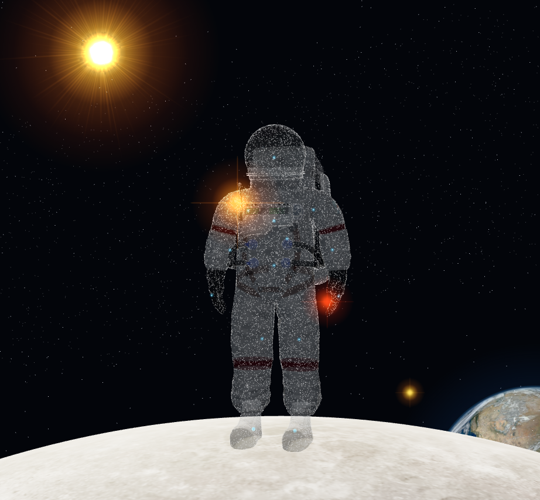
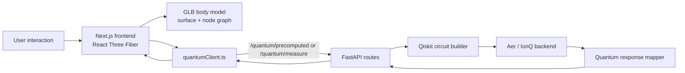

<p align="center">
  
</p>

# Entangled Body

Entangled Body is an interactive full-stack prototype that visualizes a human body as a quantum-inspired 3D system. A Next.js and Three.js frontend renders an astronaut GLB model, exposes inspect and measurement interactions, and maps quantum measurement results into visible node, region, and collapse states. A FastAPI backend generates those measurement results with Qiskit Aer, with optional IonQ simulator or hardware execution when credentials and safety gates are configured.

Website: https://entangledbody.com

<p align="center">
  
</p>

The project is designed for experimental quantum visualization, creative technology demos, and developer-facing exploration of how quantum measurement data can drive real-time spatial interfaces.

## Features

- Real-time 3D body scene built with React Three Fiber and Three.js.
- GLB model loading, surface sampling, hover detection, fixed quantum node graph, and collapse animation.
- Inspect mode for local node observation and measurement mode for global collapse behavior.
- FastAPI quantum API with health, precomputed sample, and measurement endpoints.
- 14-region body-to-qubit mapping covering head, torso, shoulders, limbs, hands, feet, and oxygen tank.
- Qiskit Aer simulator execution with structured response mapping for frontend visualization.
- Optional IonQ simulator and hardware execution, guarded by environment variables.
- Bundled precomputed samples and frontend fallback logic for API-unavailable demos.
- Docker and npm scripts for local development.

## Architecture Overview

Entangled Body is organized as a small monorepo with two runtime applications:

- `apps/web` contains the Next.js application. Its main page renders `BodyScene`, which composes the Three.js canvas, GLB model, camera controls, background music, loading intro, and quantum dashboard.
- `apps/api` contains the FastAPI service. It exposes quantum endpoints and delegates circuit construction, backend execution, and response mapping to modules under `apps/api/quantum`.


```mermaid
flowchart LR
    user[User interaction]
    web[Next.js frontend<br/>React Three Fiber]
    model[GLB body model<br/>surface + node graph]
    client[quantumClient.ts]
    api[FastAPI routes]
    circuit[Qiskit circuit builder]
    backend[Aer / IonQ backend]
    mapper[Quantum response mapper]

    user --> web
    web --> model
    web --> client
    client -->|/quantum/precomputed or /quantum/measure| api
    api --> circuit
    circuit --> backend
    backend --> mapper
    mapper --> api
    api --> client
    client --> web
```

## Project Structure

```text
.
+-- apps
|   +-- api
|   |   +-- config              # Local environment loading
|   |   +-- data                # Body region map and precomputed samples
|   |   +-- quantum             # Circuit, backend, mapper, and precompute logic
|   |   +-- routes              # FastAPI route modules
|   |   +-- tests               # Backend smoke tests
|   |   +-- Dockerfile
|   |   +-- main.py             # FastAPI application entry point
|   |   +-- requirements.txt
|   +-- web
|       +-- app                 # Next.js App Router entry files
|       +-- components          # Scene, model, controls, dashboard, audio, intro
|       +-- lib                 # Region types, API client, mapping helpers
|       +-- public              # GLB models, textures, and audio assets
|       +-- Dockerfile
|       +-- next.config.js
+-- docs                        # Architecture, accessibility, design, and operations docs
+-- examples                    # Local simulation and precomputed sample utilities
+-- infra                       # Terraform scaffold and infrastructure notes
+-- scripts                     # Cross-app setup, dev, and build scripts
+-- docker-compose.yml
+-- package.json
+-- tsconfig.json
```

## Data Flow

1. The browser opens the Next.js app and mounts `apps/web/app/page.tsx`.
2. `BodyScene` initializes the Three.js canvas and loads `/models/astronaut_rigged_and_animated.glb` through `OriginalGlbModel`.
3. `OriginalGlbModel` samples the model surface, renders the translucent body and node network, and reports hover, click, or hold interactions back to `BodyScene`.
4. `BodyScene` chooses the interaction path:
   - Inspect mode performs local node inspection.
   - Measurement mode performs a stronger global collapse interaction.
5. `quantumClient.ts` sends requests to the backend through `NEXT_PUBLIC_API_BASE_URL`, defaulting to `/api` for the local Next.js rewrite.
6. FastAPI validates the request in `routes/quantum.py`, then calls either:
   - `run_aer_measurement` for local Qiskit Aer simulation.
   - `run_ionq_measurement` for IonQ simulator or hardware requests, with Aer fallback when IonQ is unavailable or hardware is disabled.
7. The backend maps raw counts into probabilities, marginals, correlations, region states, entanglement links, and node states.
8. The frontend maps the API payload into `BodyQuantumState` and updates dashboard values, node states, visual highlighting, and collapse animation progress.
9. If the API is unavailable, the frontend falls back to bundled `precomputed_samples.json` so the interactive demo can still run.

## Tech Stack

- Next.js 15: frontend application framework.
- React 19: UI composition and state management.
- Three.js and React Three Fiber: 3D rendering, GLB loading, surface sampling, lights, camera, and animation.
- TypeScript: typed frontend code and project-level type checking.
- FastAPI: Python API service for quantum routes.
- Pydantic: request validation for measurement payloads.
- Qiskit and Qiskit Aer: circuit construction and local simulation.
- qiskit-ionq: optional IonQ simulator and QPU integration.
- Docker Compose: local multi-service development.
- Terraform scaffold: infrastructure planning under `infra/terraform`.

## API Surface

The backend exposes:

- `GET /health`: API health check.
- `GET /quantum/health`: quantum backend capability and configuration status.
- `GET /quantum/precomputed`: precomputed interaction samples.
- `POST /quantum/measure`: measurement request for `aer`, `ionq_simulator`, or `ionq_hardware`.

Example measurement payload:

```json
{
  "region": "torso",
  "interaction": "click",
  "intensity": 1,
  "shots": 128,
  "backend": "aer",
  "seed": 42
}
```

## Getting Started

Detailed local setup, commands, environment variables, tests, and Docker usage are documented in [docs/development.md](docs/development.md).

Quick start:

```bash
npm run setup
npm run dev
```

Default local URLs:

- Web: `http://localhost:3000`
- API: `http://localhost:8000`

## Configuration

Frontend runtime configuration:

- `NEXT_PUBLIC_API_BASE_URL`: API base URL used by `quantumClient.ts`; defaults to `/api`.
- `NEXT_PUBLIC_QUANTUM_REQUEST_TIMEOUT_MS`: frontend request timeout; defaults to `300000`.
- `API_PROXY_TARGET`: Next.js rewrite target for `/api/*`; defaults to `http://127.0.0.1:8000`.

Backend runtime configuration:

- `IONQ_API_KEY`
- `IONQ_BACKEND`
- `IONQ_SIMULATOR_BACKEND`
- `IONQ_QPU_BACKEND`
- `IONQ_ENABLE_HARDWARE`
- `IONQ_TIMEOUT_SECONDS`

Environment values can be loaded from the repo-root `.env` or `apps/api/.env`. Existing process environment variables take precedence.

## Testing

The repository currently includes backend smoke tests for the quantum response contract, IonQ fallback behavior, environment loading, and the hardware safety gate. Frontend automated tests are not currently defined.

See [docs/development.md](docs/development.md) for exact test commands.

## Deployment

The current documented deployment target is a static frontend behind S3 and CloudFront, with the FastAPI backend deployed through App Runner or a small ECS Fargate service. Expanded ECS, ALB, ECR, CloudWatch, and Terraform-based infrastructure are documented as a later scaling path.

See [docs/deployment.md](docs/deployment.md) and [infra/terraform/README.md](infra/terraform/README.md).

## Development Notes

- The body-region graph currently uses 14 regions and 14 qubits.
- `body_region_map.json` is the backend source for qubit indexes, spatial positions, and entanglement links, with Python fallbacks defined in `mapper.py`.
- The frontend has its own TypeScript region list in `bodyRegions.ts`; changes to region IDs should be kept in sync across frontend and backend.
- IonQ hardware submission is intentionally blocked unless both `IONQ_API_KEY` is set and `IONQ_ENABLE_HARDWARE=true`.
- The frontend is resilient to API outages by using bundled precomputed samples, but this means demo behavior can continue even when the backend is unavailable.
- `.next`, `node_modules`, `.venv`, and Python `__pycache__` directories are generated artifacts and should not be treated as source.

## Future Improvements

- Add frontend unit or integration tests for `quantumClient`, interaction modes, and fallback behavior.
- Add contract tests shared between frontend types and backend measurement responses.
- Generate frontend body region types from `body_region_map.json` to avoid duplicated region definitions.
- Add CI workflows for type checking, backend tests, Docker builds, and deployment.
- Replace permissive CORS settings with environment-specific origins before production use.
- Complete infrastructure automation for the selected deployment target.

## Attribution

Music and asset attribution is maintained in [docs/attribution.md](docs/attribution.md).

## License

This project is licensed under the MIT License. See [LICENSE](LICENSE).
