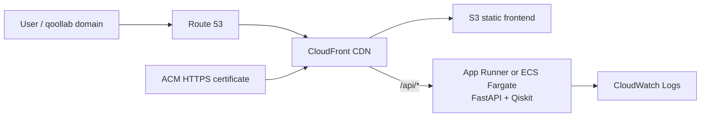
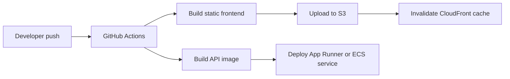
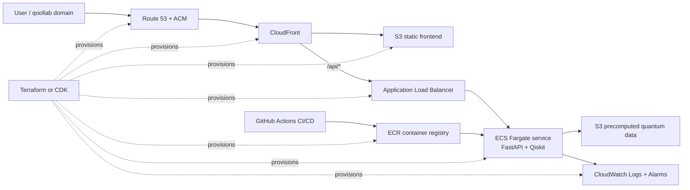

# Deployment Guide

This document captures the deployment architecture and operational notes that were previously stored in the root README.

## Initial AWS Deployment Target

The recommended first deployment uses S3 and CloudFront for the frontend, plus one managed container service for the FastAPI quantum backend. This keeps the live version inexpensive and understandable while preserving a path to more advanced AWS infrastructure later.

Recommended first version:

- Host the Next.js static frontend in S3 and serve it through CloudFront.
- Restrict the S3 origin with CloudFront Origin Access Control.
- Use Route 53 and ACM for the custom HTTPS domain.
- Deploy the FastAPI backend from the existing Docker image.
- Prefer App Runner when simplicity and cost control matter more than ECS internals.
- Use a single ECS Fargate service if the deployment needs to demonstrate ECS directly.
- Use CloudWatch Logs with short retention.
- Add an AWS Budget or billing alarm before leaving services running.

## Deployment Flow

- Frontend CI should build the static site, sync output to S3, and invalidate CloudFront.
- Backend CI should build the FastAPI container and deploy it to App Runner or ECS.
- Environment-specific values such as API base URL, AWS account ID, and service names should be stored as GitHub Actions secrets or environment variables.
- If S3 static hosting is used, the Next.js app must remain compatible with static export constraints.

## API Routing

For S3 and CloudFront deployment, the static frontend cannot rely on the local Next.js rewrite. Keep frontend API calls on `/api/*` and configure CloudFront with an ordered behavior that sends `/api/*` to the App Runner or ECS backend origin.

For local development, `apps/web/next.config.js` rewrites `/api/*` to `API_PROXY_TARGET`, defaulting to `http://127.0.0.1:8000`.

## Expansion Target

After the first deployment is stable, the architecture can expand if Entangled Body needs more control over routing, container operations, observability, or infrastructure automation.

This version provides more operational control, but it increases cost and operational surface area through ALB, ECS networking, container registry, logging, and infrastructure management.

## Cost Controls

- Avoid a NAT Gateway for the first ECS version by running the Fargate task in a public subnet with a public IP.
- Keep the Fargate desired task count at `1` for a challenge or demo deployment.
- Start with small CPU and memory values, then tune only if Qiskit workloads need more.
- Consider App Runner instead of ALB and ECS when VPC-level control is not required.
- Keep CloudWatch log retention short, such as 3-7 days.
- Use AWS Budgets or billing alarms before enabling always-on resources.
- Tear down or scale down ALB/ECS resources when they are only needed for a demo.

## Monitoring

- Use `/health` and `/quantum/health` as backend health check endpoints.
- Send backend container logs to CloudWatch Logs.
- Add alarms for service errors, unhealthy backend responses, and unexpected monthly spend.
- Start with minimal metrics and alarms, then expand once the service receives real traffic.

## Tradeoffs

- S3 and CloudFront keep the visual frontend lightweight, cacheable, and easy to serve globally.
- App Runner is the simplest first backend target because it avoids early networking complexity.
- ECS Fargate is a later expansion path when more control over runtime, routing, observability, or infrastructure-as-code is needed.
- Avoiding NAT Gateway in a small ECS version keeps fixed cloud cost low.
- Precomputed quantum data keeps hover and fallback interactions fast, predictable, and inexpensive while simulator or IonQ execution remains available for stronger measurement events.

## Infrastructure Roadmap

1. Keep the target architecture and cost controls documented.
2. Make the frontend compatible with S3 static deployment.
3. Deploy the frontend to S3 behind CloudFront with OAC.
4. Deploy the FastAPI backend to App Runner or one small ECS Fargate service.
5. Add GitHub Actions for frontend and backend deployment.
6. Add Route 53, ACM, CloudWatch logs, and budget alarms.
7. Expand to ALB, ECS Fargate, ECR, and Terraform/CDK only if the project needs stronger operational control or a fuller AWS implementation story.
